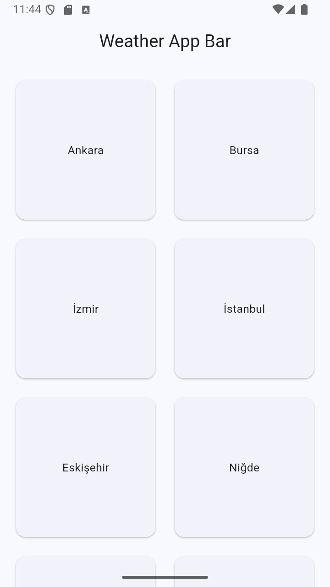
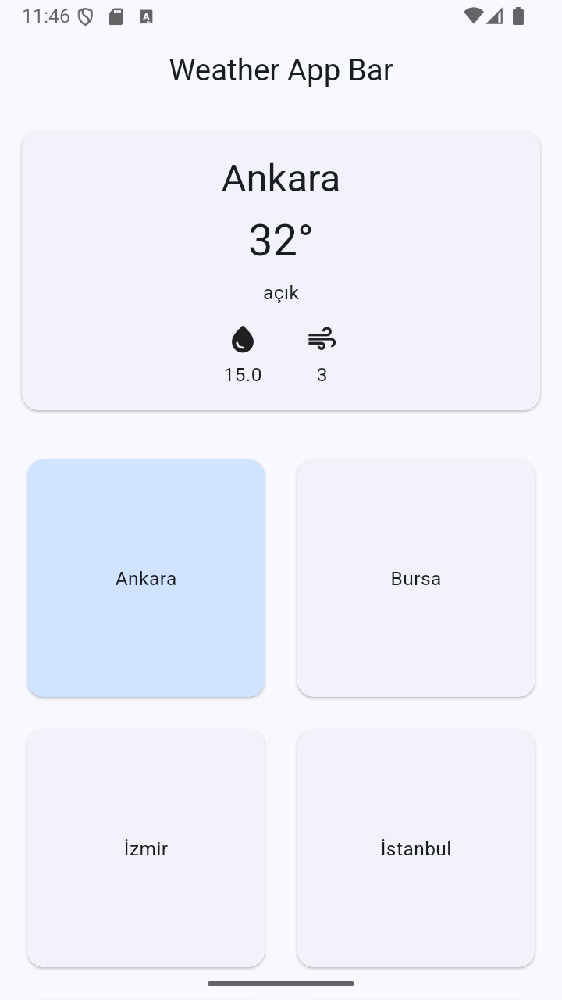

# Weather App 🌤️

Bu proje, seçilen şehir için hava durumu bilgilerini gösteren bir Flutter uygulamasıdır.  
Veriler, bir hava durumu API'si üzerinden çekilmekte ve kullanıcıya modern bir arayüz ile sunulmaktadır.

## 📌 Özellikler
- Şehir seçerek hava durumu bilgilerini getirme
- Anlık sıcaklık, durum, rüzgar ve nem bilgisi
- Modüler ve ölçeklenebilir proje yapısı (`core`, `data`, `ui` katmanları)

## 📦 Kullanılan Paketler

### [dio](https://pub.dev/packages/dio)
HTTP istekleriyle API'den veri çekmek için kullanıldı.

## 📂 Proje Yapısı
```
lib/
├── core/network/         # Ağ (network) işlemleri (Dio ayarları vb.)
├── data/models/          # Veri modelleri
├── data/services/        # API servisleri
├── ui/pages/             # Sayfalar
├── ui/widgets/           # Tekil UI bileşenleri
└── main.dart             # Uygulama başlangıç noktası

````

## 🚀 Kurulum
1. Bu projeyi klonla:
```bash
git clone https://github.com/kullaniciadi/weather.git
````

2. Paketleri yükle:

```bash
flutter pub get
```

3. API keyini yaz:

- lib/core/network/dio_client.dart dosyasına gidin.
- 'appid': değerinin karşısına kendi API keyinizi yazın.
- API keyinizi https://openweathermap.org/ adresinden oluşturabilirsiniz.

4. Uygulamayı çalıştır:

```bash
flutter run
```

## Geliştirilebilir Yönler
 - Dinamik şehir ekleme/çıkarma özelliği eklenerek kullanıcı kendi şehir listesini yönetebilir.
 - Gelecek günlerin hava durumu bilgisine ulaşma özelliği eklenerek tahminler gösterilebilir.

## 📷 Uygulama Görüntüsü
<p align="center">
  
  
</p>

> **Not:** `assets` klasörünü isterseniz silebilirsiniz.
